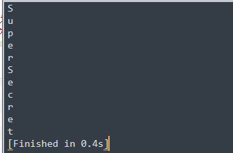

# Attack me if u can

OWASP MSTG-Hacking-Playground

``` https://github.com/OWASP/MSTG-Hacking-Playground/releases ```

writeup

``` https://github.com/OWASP/MSTG-Hacking-Playground/wiki/Android-App ```

## 1 Bad encryption

 

需要看代码，找到第一关的代码

 

看见有个判断处，将用户输入的密码加密后与vJqfip28ioydips=做判断

```    java

    private static boolean verify(String str) {
        byte[] encryptedDecoded = Base64.decode("vJqfip28ioydips=", 0);
        byte[] userPass = encrypt(str);
        if (userPass.length != encryptedDecoded.length) {
            return false;
        }
        for (int i = 0; i < userPass.length; i++) {
            if (userPass[i] != encryptedDecoded[i]) {
                return false;
            }
        }
        return true;
    }

```

用户输入的加密过程

```    java

    private static byte[] encrypt(String str) {
        byte[] bytes = str.getBytes();
        for (int i = 0; i < bytes.length; i++) {
            bytes[i] = (byte) (bytes[i] ^ 16);
            bytes[i] = (byte) ((~bytes[i]) & 255);
        }
        return bytes;
    }
}
//与16做xor运算，然后逐位取反
```

  写个脚本逆向获取明文密码

```python
import base64
s='vJqfip28ioydips='
bs=base64.b64decode(s)
for i in bs:
	i=~i&255
	i=i^16
	print(chr(i))
```

所以获得的明文密码就是SuperSecret

