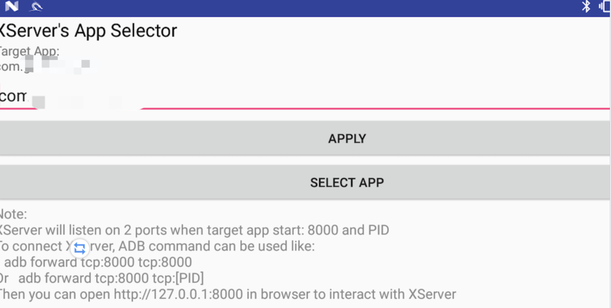

这只是个简单的说明书，因为代码真的看不懂了。
<!-- more -->
# Xserver的使用说明书
> xserver github：https://github.com/monkeylord/XServer
>
> xserver的具体逻辑自行看代码，下述文章仅讲述如何使用xserver解决一个APP的加解密问题
>
> 偷大佬的图
>
> 

## 1. 找到加解密方法

~~做APP嘛，首先需要对加解密方法定位一下，看看代码就搞定了，有壳脱个壳就行了，这步骤略。等有空了用这个再水一篇。~~

我们使用jadx打开脱壳后的dex文件，找到加解密模块。


对不起，我错了，下次一定


## 2.利用xserver hook到app

首先hook app

~~选择app包名，点上，就这，有手就行。~~



xserver上面也写的很清楚了，hook到app后需要用adb forward转发一下8000端口，不得不说界面实在太丑了。

```adb forward tcp:8000 tcp:8000```


begin后点击load all methods 就会把你填入的包名下的所有方法打印出来，然后钩上想要hook的方法，接着去app里面操作等着客户端调用到这几个hook的方法。


xserver会自行把hook的方法的堆栈信息打印出来。


## 3. xserver打印信息传到burp上

接着打开burp，开启远程监听。


在xserver 选择想要hook的方法


接着直接打开burp，抓包就行了，xserver的每个方法有两个包，request包是传入的参数，response包是return值

比如我现在hook了解密方法，那么传入的应该是密文，传出的就是明文了。


---

~~xserver的代码是真看不懂，下次再写加解密了我一定要学会brida，这玩意太丑了。~~
